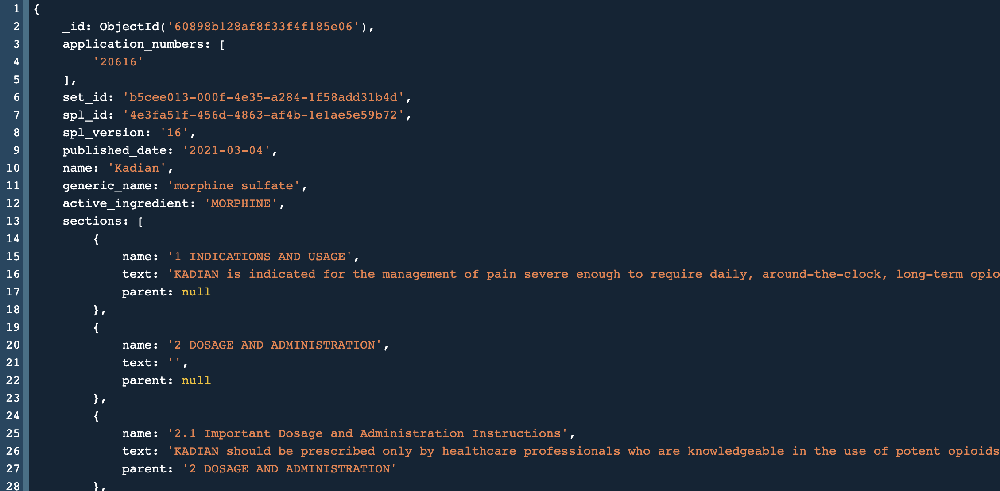

# dailymed_data_processor
Scripts to download in bulk and process the drug labels data from DailyMed.

For a given SPL index start page and number of pages of the index to process (or) a pre-configured list of DailyMed Set IDs, the scripts parse and obtain the historical set id data and label data for each SPL version. If at least one version of a label set has an association to an NDA application number, the processed labels from the Set ID are saved to MongoDB.

## Data Schema



## MongoDB Set Up
The connection info for the Mongo DB instance is set in the `.env` file. This should work for a standard MongoDB set up on localhost. If using a different set of DB configs, this file must be updated.

A sample docker set up for mongo, that maps to `localhost:27017` can be found [here](https://github.com/pharmaDB/etl_pipeline). This set up also includes the Mongo Express viewer.


## Running the Code
Requires a minimum python version of `3.6` to run.
1. `pip3 install -r requirements.txt`
2. For usage and args, run `python3 main.py -h`

### Usage Examples
* To download the history and process the label data for a pre-determined list of SPL Set IDs, use:
```
python3 main.py --set_ids_from_file=resources/set_ids.json
```

* To download the SPL index for a certain page range and process the history and labels for those Set IDs, use:
```
python3 main.py --start_page=1 --num_pages=2
```

* Results from intermediate stages (SPL index download and Set ID history download) can be written to disk using the following flags.
    - `write_index_data`
    - `write_history_data`

## Running Tests

Unit tests are created using Pytest and can be run simply using the following command, from the source root.
```
$ PYTHONPATH=. pytest
```

## Code Formatting
It is recommended to use the [Black Code Formatter](https://github.com/psf/black) which can be installed as a plugin for most IDEs. `pyproject.toml` holds the formatter settings.
